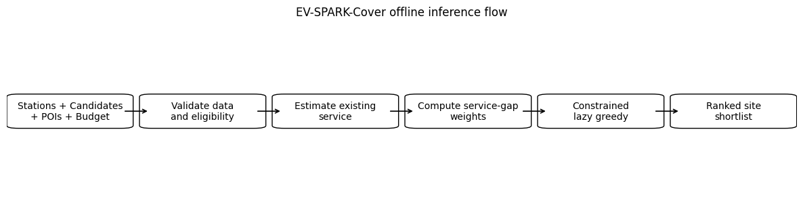

# EV-SPARK-Cover v1.3.1

EV-SPARK-Cover là phương pháp lựa chọn vị trí trạm sạc xe điện có xét đến mạng lưới hiện hữu, khoảng trống dịch vụ và các ràng buộc không gian.

## Nội dung dự án

Repository lưu trữ các tài liệu và kết quả chính của phiên bản v1.3.1:

- Notebook chạy pipeline end-to-end và robustness analysis.
- Notebook trực quan hóa benchmark.
- Output bundle gồm configuration, benchmark tables, selected sites, ablation, robustness và audit results.

## Phương pháp

Pipeline sử dụng:

- Non-negative Ridge để tạo contextual POI weights.
- Existing-network coverage estimation.
- Service-gap weighting.
- Saturating soft-coverage objective.
- Constrained lazy-greedy selection.
- Hidden-station recovery để đánh giá hồi cứu.

Hidden stations là operational anchors, không phải ground-truth optimal siting labels.

## Kết quả chính

Ở budget 5%, EV-SPARK-Cover:

- Tăng held-out demand capture và Recall@2km so với static coverage.
- Giảm mean service distance, P95 distance và selected-site redundancy.
- Chấp nhận aggregate coverage thấp hơn để tạo phần dịch vụ bổ sung phù hợp hơn với mạng hiện hữu.

## Tài liệu chính

- `EV_SPARK_Cover_End_to_End_v1_3_1_ROBUSTNESS_paper_run_.ipynb`
- `EV_SPARK_Cover_Benchmark_Charts_v1_3_1_FINAL_paperfriendly.ipynb`
- `EV_SPARK_Cover-v131.zip`

## Giới hạn

Dự án hiện là strategic screening pipeline, chưa phải hệ thống production. Phương pháp chưa tích hợp road travel time, land cost, grid capacity, queueing, charger sizing, API hoặc dashboard.
